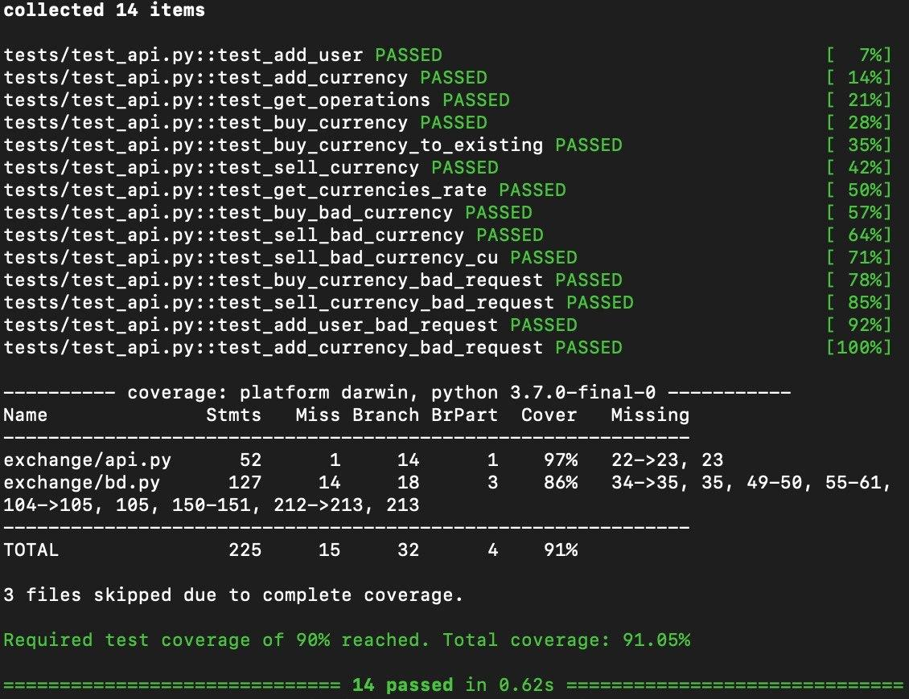

# Currency exchange

#### Требования
Python версии не ниже 3.7

#### Описание
Функции API:
Принимает get, post и put запросы

GET:

    /exchange/currencies_rate/<string:currency_name>
    /exchange/operation_list/<string:username>

POST:

    /exchange/registration
    /exchange/add_currency

PUT:

    /exchange/sell_currency
    /exchange/buy_currency

 
#### Пример запуска:     
    make up

#### Как работать 
1 `make venv` - дополнительные зависимости

2 `make test` - запуск тестов

3 `make format lint` - прохождение линтеров
    
##### Используемые библиотеки
* `flask`
* `sqlalchemy`
* `typing`
* `random`
* `time`
* `os`
* `threading`

### Тесты
> Покрытие тестами более 90%

