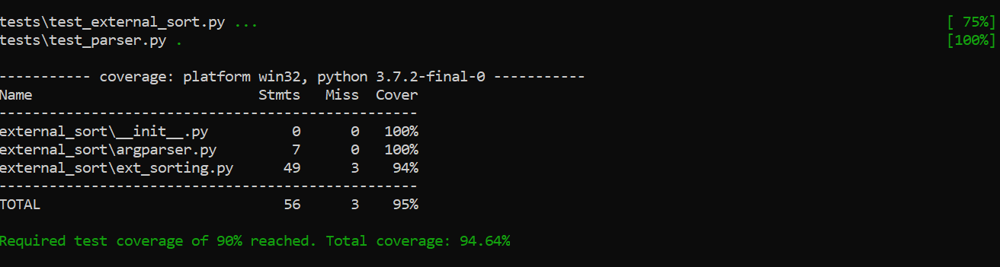

# External Sort
> Программа предназначена для сортировки больших файлов

#### Требования
Python версии не ниже 3.6

##### Состав
Консольная версия сортировки: ext_sorting.py

#### Пример запуска: 
    ./external_sorting/ext_sorting.py 1024 ./input.txt ./out.txt
    
    или
    
    external_sorting 1024 ./input.txt ./out.txt

#### Как работать 
1 `python setup.py install` - установка основного пакета

2 `make venv` - дополнительные зависимости

3 `make test` - запуск тестов
    
##### Используемые библиотеки
* `os, os.path`
* `sys`
* `hashlib`
* `argparse`
* `shutil`
* `heapq`

### Тесты
> Покрытие тестами более 90%

