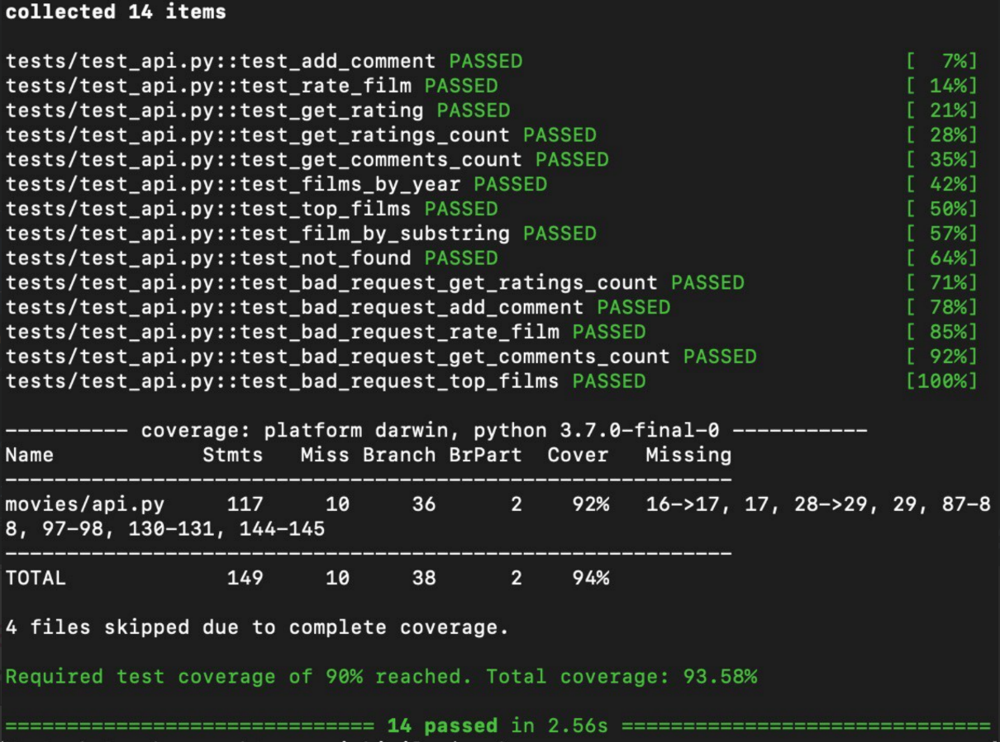
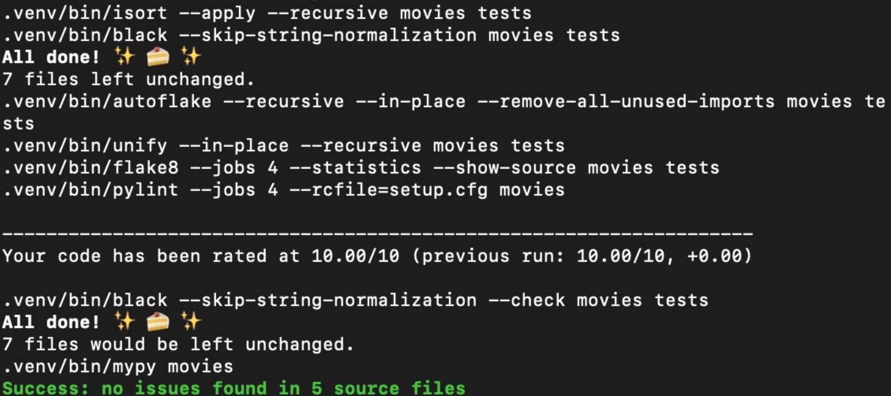

# Movies

#### Требования
Python версии не ниже 3.7

#### Описание
Функции API:
Принимает запрос в формате json

    {
        "jsonrpc": "2.0",
        "id": "1",
        "method": method,
        "params": description
    }
    
Где "method" один из 

    1. add_comment - добавляет комментарий от залогиненого позьзователя
    2. rate_film - оценить фильм
    3. get_rating - узнать рейтинг фильма
    4. get_ratings_count - узнать количество оценок фильма
    5. get_comments_count - узнать количество комментариев фильма
    6. get_films_by_year - узнать фильмы выпущенные в определенном году
    7. get_films_by_substring - узнать фильмы с заданой строкой в описании
    8. get_top_films - вывести топ фильмов с оценкой не меньше n

description - словарь с задаными параметрами

    {
        'name_film': строка,  -  обязательный параметр для методов 1-5
        'username': строка, - обязательный параметр
        'substring': строка, - обязательный параметр для метода 7
        'year': число, - обязательный параметр для метода 6
        'comment': строка, - обязательный параметр для метода 1
        'rate': число от 0 до 10, - обязательный параметр для методов 2 и 9
        
    }    
 
##### Состав
Консольная версия: api.py

#### Пример запуска:     
    make up

#### Как работать 
1 `python setup.py install` - установка основного пакета

2 `make venv` - дополнительные зависимости

3 `make test` - запуск тестов

4 `make format lint` - прохождение линтеров
    
##### Используемые библиотеки
* `flask`
* `base64`
* `typing`

### Тесты
> Покрытие тестами более 90%

### Линтеры
> Удачное прохождение линтеров
 

    
    