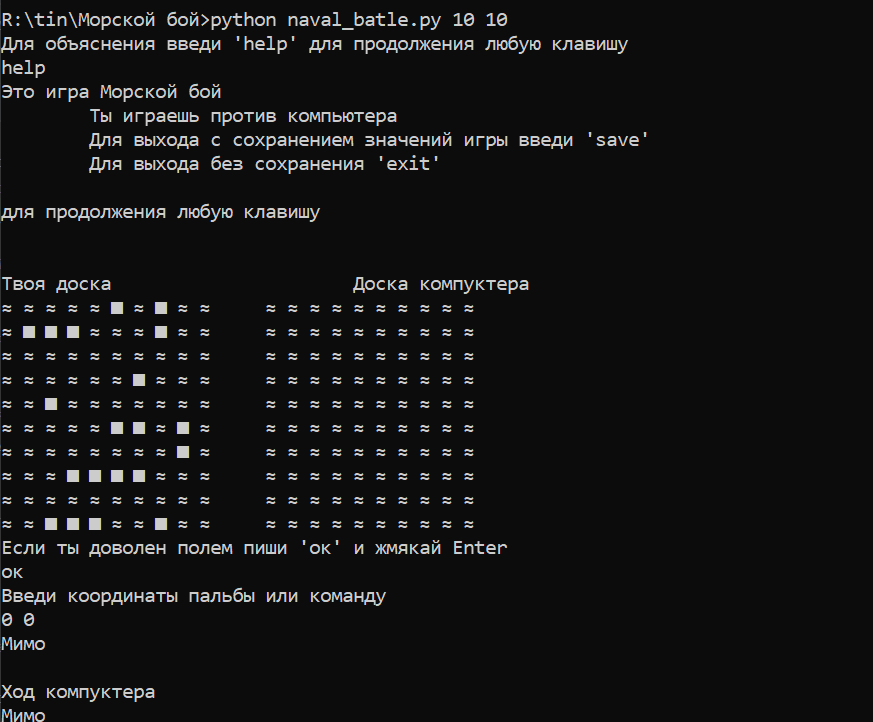

# Морской бой
> Игра предназначена для одного пользователя. Оппонент - компьютер.

### Правила игры
В этой версии игры, пользователь сам задает размерность поля (не меньше, чем 5х5)
Реализована автоматическая расстановка кораблей - в начале игры пользователь может изменить расстановку.
Нельзя бить в одну и ту же клетку больше одного раза. 
Реализован механизм сохранения состояния игры и возврата к предыдущей версии.
### Игра

#### Требования
Python версии не ниже 3.6

##### Состав
Консольная версия игры: naval_battle.py

#### Пример запуска: 
    ./game_window.py 10 10

##### Команды

| команда  |   действие  |
|---------------|---------------------|
| save |      выход с сохранением состояния |
| exit |      выход без сохранения и удаление существующего сохраненияи|

##### Используемые библиотеки
* `os`
* `enum`
* `sys`
* `random`
* `argparse`
* `pickle`

