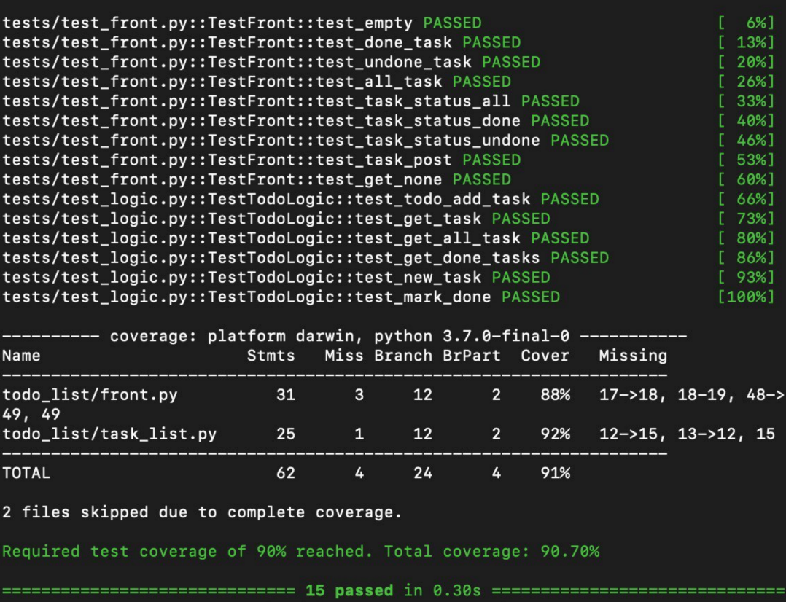

# ToDo list

#### Требования
Python версии не ниже 3.7

##### Состав
Консольная версия: front.py

#### Пример запуска: 
    ./todo_list/front.py
    
    или
    
    make up

#### Как работать 
1 `python setup.py install` - установка основного пакета

2 `make venv` - дополнительные зависимости

3 `make test` - запуск тестов

4 `make format lint` - прохождение линтеров
    
##### Используемые библиотеки
* `flask`

### Тесты
> Покрытие тестами более 90%

### Линтеры
> Удачное прохождение линтеров
 
